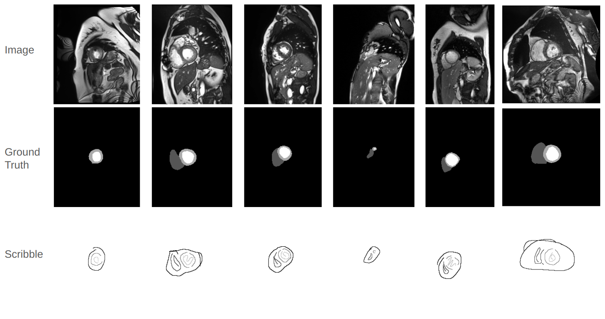
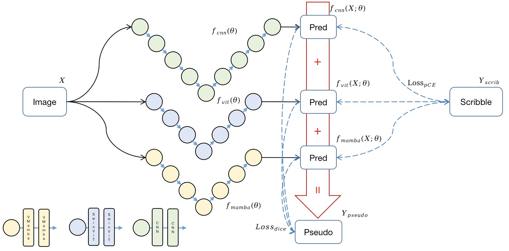
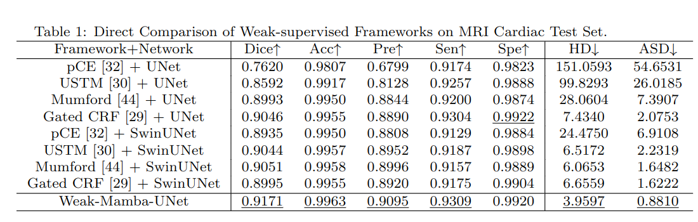

<div align="center">
<h1> <b>Weak-Mamba-UNet</b>: <br /> Visual Mamba Makes CNN and ViT Work Better for Scribble-based Medical Image Segmentation </h1>

[](https://arxiv.org/abs/2402.10887)

</div>

> This repo provides an implementation of the training and inference pipeline for [Weak-Mamba-UNet](https://arxiv.org/abs/2402.10887). 


## Contents ###
- [Graphical Abstract](#Graphical-Abstract)
- [Results](#Results)
- [Requirements](#Requirements)
- [Usage](#Usage)
- [Reference](#Reference)
- [Contact](#Contact)

 


## Graphical Abstract

The introduction of Scribble Annotation



The proposed Framework




## Results




## Requirements
* Pytorch, MONAI 
* Some basic python packages: Torchio, Numpy, Scikit-image, SimpleITK, Scipy, Medpy, nibabel, tqdm ......

```shell
cd casual-conv1d

python setup.py install
```

```shell
cd mamba

python setup.py install
```


## Usage

1. Clone the repo:
```shell
git clone https://github.com/ziyangwang007/Weak-Mamba-UNet.git
cd Weak-Mamba-UNet
```

2. Download Pretrained Model

Download through [Google Drive](https://drive.google.com/file/d/14RzbbBDjbKbgr0ordKlWbb69EFkHuplr/view?usp=sharing) for SwinUNet, and [[Google Drive]](https://drive.google.com/file/d/1uUPsr7XeqayCxlspqBHbg5zIWx0JYtSX/view?usp=sharing) for Mamba-UNet, and save in `../code/pretrained_ckpt`.

3. Download Dataset

Download ACDC for Weak-Supervised learning through [[Google Drive]](https://drive.google.com/file/d/1XR_Id0wdvXY9QeKtdOdgJHKVJ-nVr2j1/view?usp=sharing), or [[Baidu Netdisk]](https://pan.baidu.com/s/1dHkp9daqE3kLEbAP6zl7Jw) with passcode: 'rwv2', and save in `../data/ACDC` folder.


4. Train


5. Test

Test CNN-based model
```shell
python test_2D_fully.py -root_path ../data/XXX --exp ACDC/XXX
```

Test ViT/Mamba-based model
```shell
python test_2D_fully_ViT.py -root_path ../data/XXX --exp ACDC/XXX
```


## Reference
Wang, Ziyang, et al. "Mamba-unet: Unet-like pure visual mamba for medical image segmentation." arXiv preprint arXiv:2402.05079 (2024).

Wang, Ziyang, and Chao Ma. "Weak-Mamba-UNet: Visual Mamba Makes CNN and ViT Work Better for Scribble-based Medical Image Segmentation." arXiv preprint arXiv:2402.10887 (2024).


```bibtex
@article{wang2024mamba,
  title={Mamba-unet: Unet-like pure visual mamba for medical image segmentation},
  author={Wang, Ziyang and Zheng, Jian-Qing and Zhang, Yichi and Cui, Ge and Li, Lei},
  journal={arXiv preprint arXiv:2402.05079},
  year={2024}
}

@article{wang2024weakmamba,
  title={Weak-Mamba-UNet: Visual Mamba Makes CNN and ViT Work Better for Scribble-based Medical Image Segmentation},
  author={Wang, Ziyang and Ma, Chao},
  journal={arXiv preprint arXiv:2402.10887},
  year={2024}
}
```
## Contact

ziyang [dot] wang17 [at] gmail [dot] com
